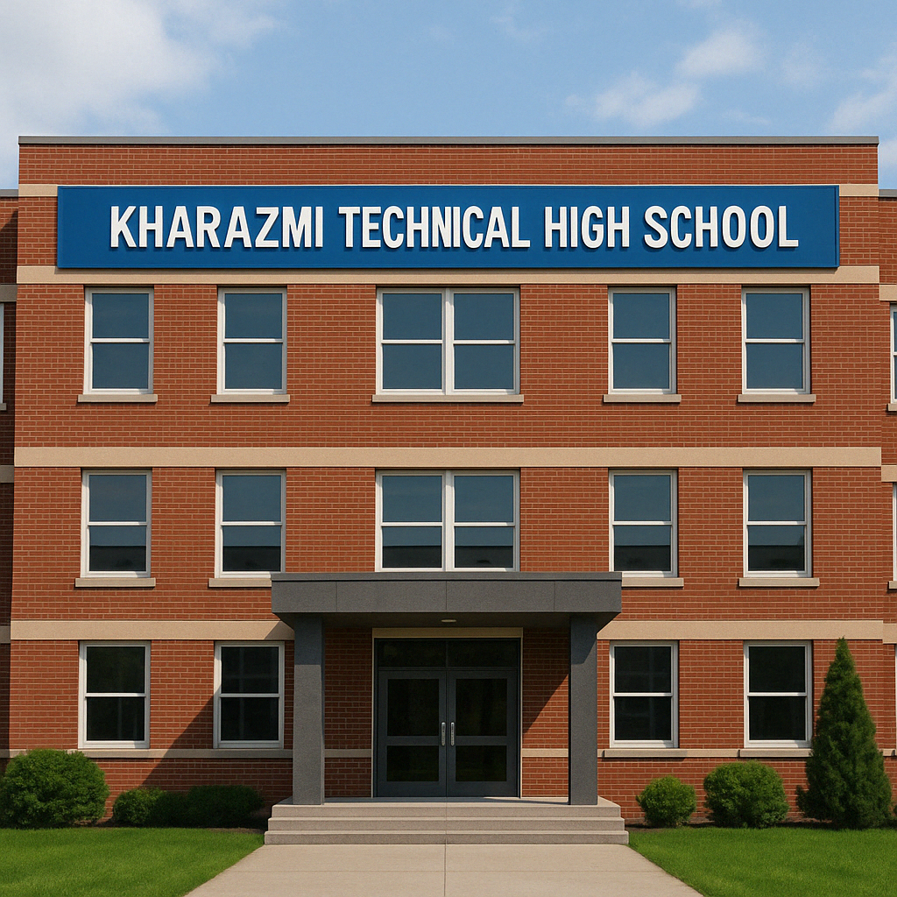

<table>
  <tr>
    <td style="width: 40%;">
      
    </td>
    <td style="vertical-align: top; padding-left: 20px;">
      

        <strong>Kharazmi Technical High School</strong> is a specialized educational institution focused on providing students with practical, career-oriented training alongside their academic studies. Named after the renowned Persian mathematician and scholar Al-Khwarizmi, the school emphasizes STEM education—particularly engineering, computer science, and industrial technology. It offers hands-on learning through workshops, labs, and real-world projects, aiming to equip students with the technical skills needed in today's job market. Students often graduate with certifications or qualifications that prepare them for immediate employment or further education in technical fields. The school fosters a culture of innovation and critical thinking, encouraging students to solve complex problems and develop new technologies.
      

    </td>
  </tr>
</table>

